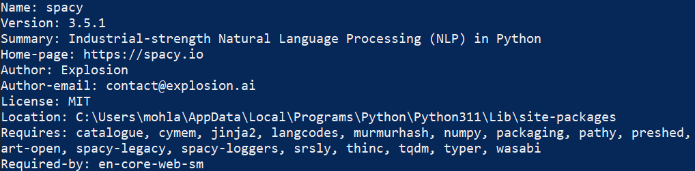

# Garden-Path Sentences
GPS - <i style="color:orange;">Pun intended</i>

This is a simple program that enumerates all sentences -  
in a sentence list and tokenize each one.  
  
# Tools
<a href="https://www.python.org/downloads/" target="_blank"><span style="color:orange;">Python</span></a>  
<span style="color:orange;">SpaCy</span>  
<span style="color:orange;">Language Model <b>[ <span style="color:green;">English</span> ]<b></span>  

# Installations  
### Environment setup 
- Download the latest, correct <a href="https://www.python.org/downloads/" target="_blank"><span style="color:orange;">Python</span></a> version for your operating system and install it.
- Once python is installed, open command line and enter the command below:  
```
python -m pip install spacy  
```  
- To confirm successful installation of spacy, enter the following command:
```
pip show spacy
```  
- Results should be similar to the following  
  

- To download English Model, enter the following command:
```  
python -m spacy download en_core_web_sm 
```  
- Now we can run the program using the following command  
```  
python garden.py  
```  
  
# Have fun

